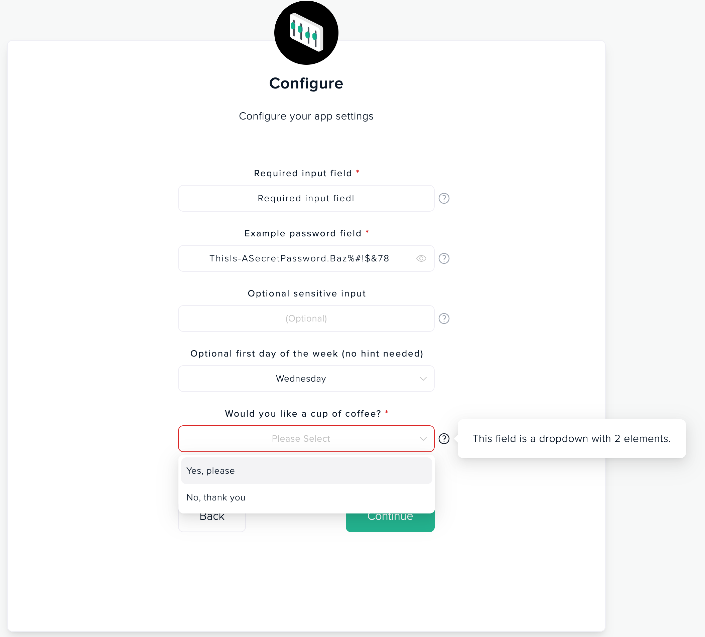

# Application settings example

This a sample application which shows a Marketplace application with various options supported in application settings.
More details about how mapping works and how to use it in your Marketplace application can be found in [Application settings guide](https://docs.marketplace.socotra.com).

> This sample is not intended to be a "production quality" application and should be used for reference and illustration only.

# How it works, what it shows?

App manifest contains a section which collects customer's specific settings. These elements will be used to create a configuration step for an app when it's being launched by a customer. Application can retrieve application settings for a specific routeid in runtime, using a key injected in a header of every request to an app.

Upload, configure and launch an instance this application in Socotra Marketplace.
During configuration step, customer will see a screen with application settings which needs to be configured before app will be launched:



Application vendor can declare as many settings for an application as they need. Customers would need to provide values or select one of the options from drop-downs. These settings can be used in runtime to perform customer-specific business login

This application sample shows a variety of settings that can be configured in app manifest.

After application launches, a call to an endpoint url can be made by any browser.
In the response application will output all the application settings configured by a customer for this instance.

Example check
- Open a url in a browser
`https://<Endpoint URL e.g. https://abc123.sandbox.outpost.marketplace.socotra.com>/show-settings`

- Endpoint responds with configured settings which may look like :
```json
{
  "socotraApiUrl": "https://api.sandbox.socotra.com",
  "tenantHostName": "User-configeditor.co.api.socotra.com",
  "token": "<JWT token to access connected Socotra tenant instance>",
  "settings": {
    "week-start-day": "WED",
    "input-setting": "Required input fiedl",
    "password-setting": "ThisIs-ASecretPassword.Baz%#!$&78",
    "boolean-selector": "true"
  }
}
```

> **Warning:**
> Application developers MUST NOT print/display/write customer's settings from a runtime of their application to any output or logging facilities.

Over time, as Marketplace manifest support for settings will be expanded - this sample will be updated with latest changes.

---


## How to run and deploy this sample to Socotra Marketplace

### Step by step guide

> Run `npm install` once per project to restore all required dependencies in the project.

1. Create a Draft application in your Organization at [Socotra Marketplace](https://marketplace.socotra.com/publish). At the end of the process there will be instruction how to initialize new application manifest and full application name. E.g. `blueprints-org/app-settings-sample`.

2. Update manifest file **socotra-app.json** and set the name of this sample to a name of created application from step 1 :
```
{
    "name":"blueprints-org/app-settings-sample",
    ...
}
```

3. Compile sample application. This will create `./dist` directory with compiled code to package into docker.
```
npm run build-app
```


4. Build docker image with application locally. This command will build a docker image from Dockerfile and `./dist/` content and tag this image as `app-settings-sample:latest` in local docker storage.

```
IMG=app-settings-sample npm run build-docker
```

5. Increment application version in manifest file `socotra-app.json` so we can publish and upload new docker image without expecting any version conflict:
```
npm run increment-version
```

6. Upload new version of the app to Socotra Marketplace draft from step 1:

```
IMG=app-settings-sample npm run publish-marketplace
```

After upload process completes and new application version is published in Socotra Marketplace - you can launch an instance of an app using Marketplace's [website](https://marketplace.socotra.com/).

