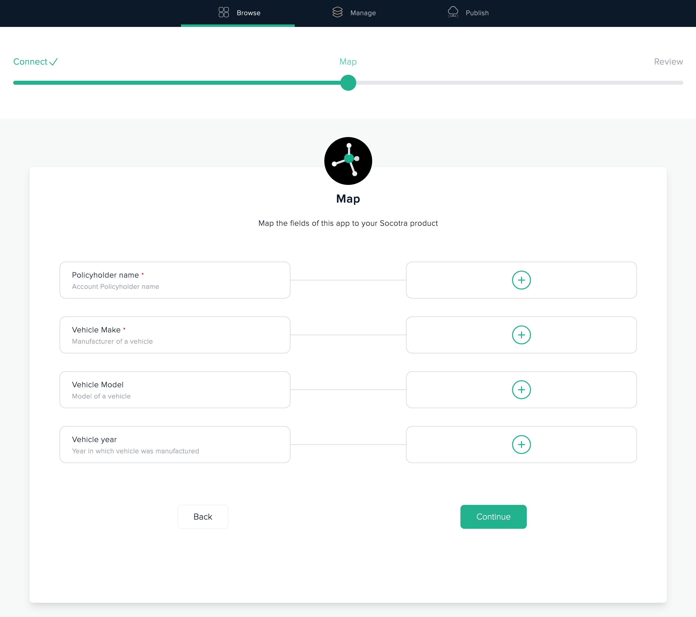

# Product mappings application

This a sample application which shows a Marketplace application with multiple field mappings of various types.
More details about how mapping works and how to use it in your Marketplace application can be found in [Product fields mapping guide](https://socotra.atlassian.net/wiki/spaces/MD/pages/2634219752/Product+fields+mapping).

> This sample is not intended to be a "production quality" application and should be used for reference and illustration only.

# How it works, what it shows?

App manifest contains a section which defines multiple required and optional product field mappings. These elements will be used to create a configuration step for an app when it's being launched by a customer. Application can retrieve these mapping in runtime using a key injected in a header of every request to an app.

Upload, configure and launch an instance this application in Socotra Marketplace.
During configuration step, customer will see declared mappings and have to provide a mapping to a product in their configured tenant for all required fields:



By default all declared fields are optional. If the field is configured as required - it will be marked with red `*` symbol after a field title (see illustration above).

To indicate that mapping field is **required** - developer needs to add `"required":true` attribute to it, such as:

```
...
{
  "name": "vehicle-make",
  "title": "Vehicle Make",
  "required": true
}
...
```

Application vendor can declare as many fields for an application as they need. Customers would need to map all required fields before they can launch an app. These mappings would provide an app all necessary information about how to retrieve values from Socotra Core product or policyholder documents from a specific customer tenant.

This application sample shows a small set of fields that can be mapped by customer.
After application launches, a call to an endpoint url can be made by any browser. In the response application will output all the fields paths configured by a customer for this instance.

Example check
- Open a url in a browser
`https://<Endpoint URL e.g. https://abc123.sandbox.outpost.marketplace.socotra.com>/show-mapping`
- Application responds with configured settings which may look like :
```json
{
  "settings":{},
  "mappings":
  [
    {
      "productName": "policyholders",
      "fields":
      {
        "policy-holder-name": "policyholder.fields[?(@.name=='last_name')]"
      }
    },
    {
      "productName": "product1",
      "fields":
    	{
        "vehicle-year": "$[?(@.name=='product1')].policyConfiguration.exposures[?(@.name=='vehicle')].fields[?(@.name=='year')]",
        "vehicle-make": "$[?(@.name=='product1')].policyConfiguration.exposures[?(@.name=='vehicle')].fields[?(@.name=='make')]",
        "vehicle-model": "$[?(@.name=='product1')].policyConfiguration.exposures[?(@.name=='vehicle')].fields[?(@.name=='model')]"
      }
    }
  ]
}
```


# How to run and deploy this sample application to Socotra Marketplace

## Step by step guide

> Run `npm install` once per project to restore all required dependencies in the project.

1. Create a Draft application in your Organization at [Socotra Marketplace](https://marketplace.socotra.com/publish). At the end of the process there will be instruction how to initialize new application manifest and full application name. E.g. `blueprints-org/product-fields-app`.

2. Update manifest file **socotra-app.json** and set the name of this sample to a name of created application from step 1 :
```
{
    "name":"blueprints-org/product-fields-app",
    ...
}
```

3. Compile sample application. This will create `./dist` directory with compiled code to package into docker.
```
npm run build-app
```


4. Build docker image with application locally. This command will build a docker image from Dockerfile and `./dist/` content and tag this image as `product-fields-app:latest` in local docker storage.

```
IMG=product-fields-app npm run build-docker
```

5. Increment application version in manifest file `socotra-app.json` so we can publish and upload new docker image without expecting any version conflict:
```
npm run increment-version
```

6. Upload new version of the app to Socotra Marketplace draft from step 1:

```
IMG=product-fields-app npm run publish-marketplace
```

After upload process completes and new application version is published in Socotra Marketplace - you can launch an instance of an app using Marketplace's [website](https://marketplace.socotra.com/).

