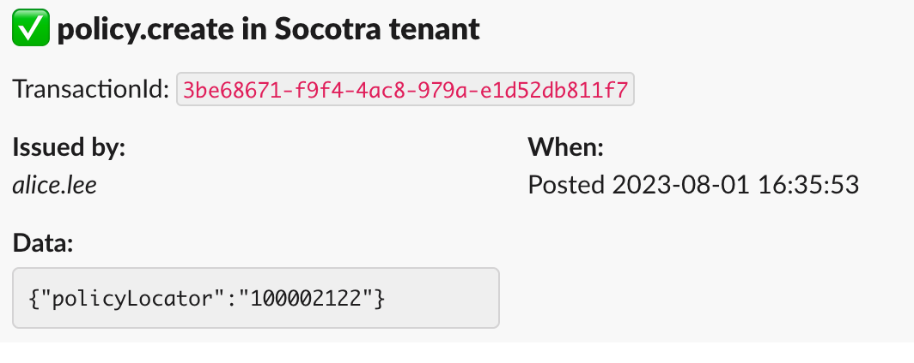

# Webhooks example

This a sample application which illustrates how to enable and configure webhooks support in a Marketplace application. Webhooks is an integral feature of Socotra Core and can be used to extend Socotra's functionality to provide custom reactions to certain events.
See [Socotra Core Webhooks documentation](https://docs.socotra.com/production/tooling/webhooks.html) for more details about main features.

Marketplace Platform simplifies creation of webhook integration apps for developers. Declarations in app manifest are processed by platform services and register all required integrations in configured Socotra tenant, as well as provides routing for incoming calls so application can focus on handlinng webhooks business logic.

More details about how webhoooks implemented in Marketplace Platform and how to configure  Marketplace app webhook support can be found in [Webhooks guide](https://docs.marketplace.socotra.com).

> This sample is not intended to be a "production quality" application and should be used for reference and illustration only.

# How it works, what it shows?

App manifest contains a section which enables webhooks support and declares certain application paths to be registered as webhook handlers of Socotra events.

Upload, configure and launch an instance this application in Socotra Marketplace.
After application is fully


This application sample shows how to register a webhook path, define which events it will be handling and will send a copy of webhook payload to another, slack pre-configured webhook.
This example uses Slack channel webhooks just for illustration purposes.


After application launches, a customer needs to provide Slack webhook url.
These can be configured in any slack tenant using [official Slack guidelines here](https://api.slack.com/messaging/webhooks).

> **Warning:**
> Application developers MUST NOT print/display/write customer's settings from a runtime of their application to any output or logging facilities.

When a certain event occurs in Socotra Core, it will send a webhook to a marketplace application and this app will send a message to Slack webhook, using customer configured address.

This is an example how slack message will look in a channel:



---


## How to run and deploy this sample to Socotra Marketplace

### Step by step guide

> Run `npm install` once per project to restore all required dependencies in the project.

1. Create a Draft application in your Organization at [Socotra Marketplace](https://marketplace.socotra.com/publish). At the end of the process there will be instruction how to initialize new application manifest and full application name. E.g. `blueprints-org/webhooks-sample`.

2. Update manifest file **socotra-app.json** and set the name of this sample to a name of created application from step 1 :
```
{
    "name":"blueprints-org/webhooks-sample",
    ...
}
```

3. Compile sample application. This will create `./dist` directory with compiled code to package into docker.
```
npm run build-app
```


4. Build docker image with application locally. This command will build a docker image from Dockerfile and `./dist/` content and tag this image as `webhooks-sample:latest` in local docker storage.

```
IMG=webhooks-sample npm run build-docker
```

5. Increment application version in manifest file `socotra-app.json` so we can publish and upload new docker image without expecting any version conflict:
```
npm run increment-version
```

6. Upload new version of the app to Socotra Marketplace draft from step 1:

```
IMG=webhooks-sample npm run publish-marketplace
```

After upload process completes and new application version is published in Socotra Marketplace - you can launch an instance of an app using Marketplace's [website](https://marketplace.socotra.com/).

